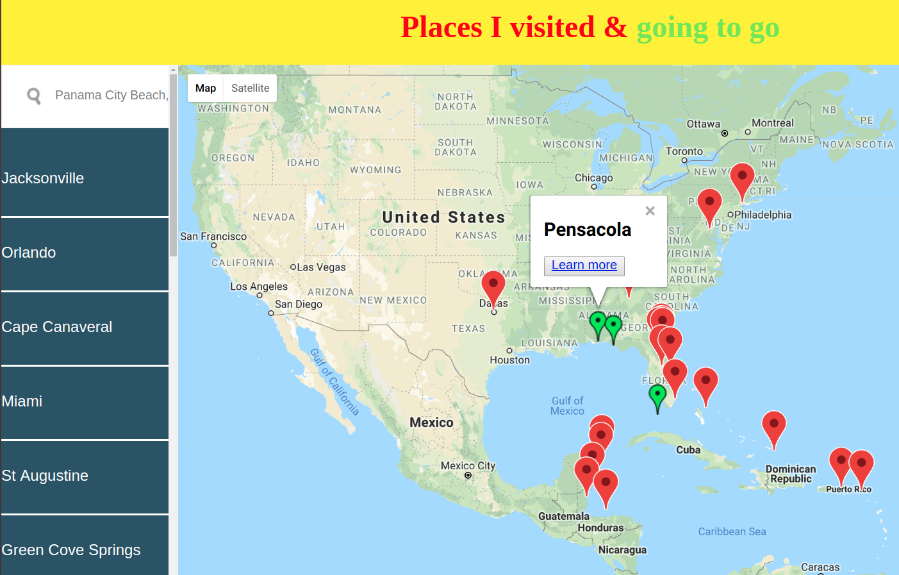

# Travel Map

Travel Map is a Single Page Application built with React.js

## Table of Contents

- [Instalation](#instalation)
- [How to use](#how-to-use)
- [Sending Feedback](#sending-feedback)

## Instalation

Run in your terminal:

```
git clone git@github.com:VolodymyrPliuta/React-travel-map.git
```

then

```
cd React-travel-map
npm start
```

## How to use

Red markers on the map are places I have been to<br>
To add places where I am going to I have to type<br>
in the search box, a name of the place I am going to<br>
To learn more about place click on the marker and<br>
click on Learn more button. You will get a new page<br>
with first 10 from Unsplash.com which match the search<br>
word as well as first 10 articles from New York Times<br>
If a journey route is going to be changed, to delete<br>
green marker just double click on it<br>

## Sending Feedback

Always open to [your feedback](https://github.com/volodymyrpliuta/React-travel-map/issues).

